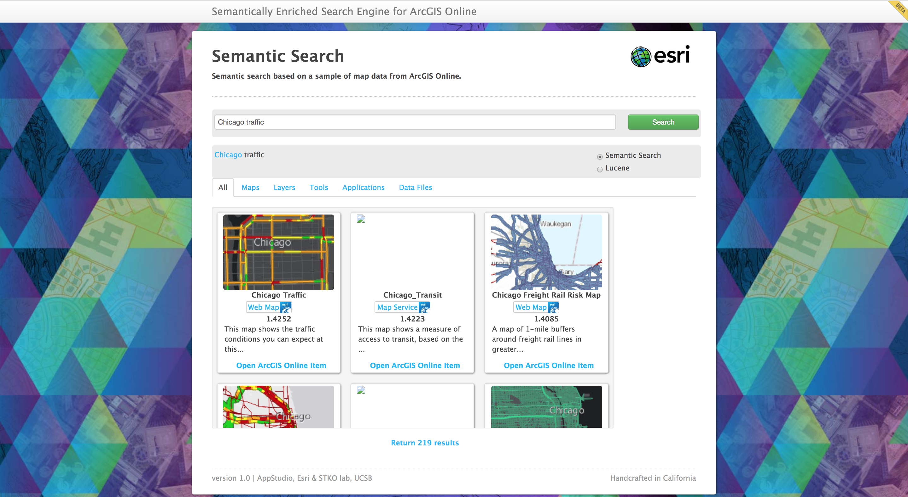

# Semantically-Enriched Search Engine for Geoportals:  A Case Study with ArcGIS Online
Code for our ArcGIS Online semantically-enriched search engine presented in [our AGILE 2020 paper](http://www.geog.ucsb.edu/~gengchen_mai/).

## Search Engine Architecture
<p align="center">
  
</p>

## Search Engine Interface
<p align="center">
  
</p>

## Search Engine Mobile Interface
<p align="center">
  
  
</p>


### Python Dependencies
- Python 3.5
- Other required python packages are summarized in `requirements.txt`.

Note that if you have different version of Python3, we can simply change the python path `pythonPath: '/usr/bin/python3.5'` in `server/routes/index.js`.

### NodeJS Dependencies
- All required NodeJS packages are summarized in `package.json`.

To install them, do `npm install`.

### Application
To launch this application, run `npm start`.

This application is sitting on top of an [Elasticsearch 5.4.0](https://www.elastic.co/blog/elasticsearch-5-4-0-released) index along with a [vector scoring plugin](https://github.com/MLnick/elasticsearch-vector-scoring).

### Word Embedding Data
You can donwload the Glove word embedding file `glove.6B.100d.txt` from [here](https://github.com/chakki-works/chakin) and put it into `server/data/`.

### Annotation Data
<p align="center">
  
  The Amazon Mechanical Turk data annotation interface
</p>

You can find the benchmark dataset in `annotation-data/`. `annotation-data/f_SEM_0.html` is one example suvey form for AMT annotation process.


### Reference
If you find our work useful in your research please consider citing our paper.  
```
@inproceedings{arcgisonline_agile2020,
	title={Semantically-Enriched Search Engine for Geoportals: A Case Study with ArcGIS Online},
	author={Mai, Gengchen and Janowicz, Krzysztof and Prasad, Sathya and Shi, Meilin and Cai, Ling and Zhu, Rui and Regalia, Blake and   Lao, Ni},
	booktitle={AGILE 2020},
	year={2020},
	organization={Springer}
}
```
